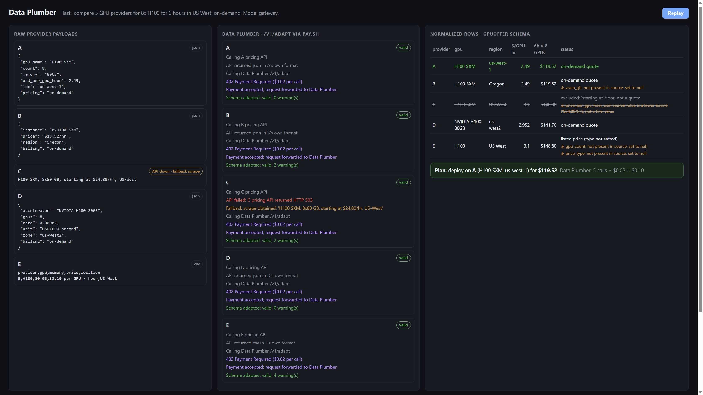

# Data Plumber

A paid, agent-facing API that turns **any upstream payload** into **the exact JSON shape the next step needs**, and says honestly what it could not find.

```
POST /v1/adapt    { source, target_schema, instructions? }  ->  { data, valid, warnings }
```

Agents call it through [Pay.sh](https://pay.sh): unpaid requests get `402 Payment Required`, the agent's `pay` client settles **$0.02** in stablecoin, and the request goes through. No accounts, no API keys for the caller.



## Why

Agent workflows break at the seams between tools:

- **Recovery.** A planned API fails, the fallback (a scrape, a cached text snippet, a CSV export) comes back in a different shape, and the workflow stalls or the planner model guesses. Data Plumber reshapes the fallback into the schema the workflow already expects, so the run continues.
- **Context and tokens.** Every provider speaks its own format (`usd_per_gpu_hour`, `"$19.92/hr"` for a whole 8-GPU box, `USD/GPU-second`, a CSV row). An expensive planner model wastes context and money normalizing that and still gets the arithmetic wrong. Offloading it costs a flat $0.02 per payload, and the planner only ever sees clean, validated rows.

The rule: **the model decides what the data means; code decides whether the result is valid and does the exact math.**

## Architecture

```
agent / planner ──► Pay.sh gateway (:1402) ──402 / pay──► Data Plumber API (:8000) ──► Fireworks LLM
                    payment lives only here               no payment code
```

Inside `POST /v1/adapt`:

| Step | Module | What it does |
|---|---|---|
| parse | `app/services/parser.py` | JSON (object / array / JSON string), CSV (with or without header), or text. Malformed input fails with 422. |
| annotate | `app/services/annotator.py` | Extracts every number with an id (`q1..qn`): money + per-unit (`$19.92/hr`, `USD/GPU-second`), counts (`8x80 GB`, `8xH100`), sizes, spelled-out numbers, and qualifiers (`starting at`, `~`, `up to`, `est.`). |
| map | `app/services/llm_mapper.py` | The LLM (Fireworks, structured JSON output) proposes each target field: value, evidence, interpretation, and a **formula over quantity ids** (`q3 / q1`, `q4 * SECONDS_PER_HOUR`). No mental math. |
| normalize | `app/services/normalizer.py` | Evaluates formulas exactly (`app/services/expressions.py`, AST whitelist), coerces types, snaps enums, and **rejects ungrounded values**: numbers must come from the source or a formula that actually depends on it, strings and enum labels must appear in the source. Rejected values become `null` plus a warning. |
| validate | `app/services/validator.py` | JSON Schema (Draft 2020-12) validation of the result. |
| repair | `app/services/repair.py` | One repair round-trip to the model if its output is malformed or fails validation (skipped when the only gap is a field that is honestly missing). |
| output | `app/services/pipeline.py` | `{data, valid, warnings}`; with `?debug=true` also a per-field `trace` and `repaired`. |

Array targets (`{"type":"array","items":{...object...}}`) are supported; each element is mapped separately.

## API contract

**Request**

```json
{
  "source": { "content_type": "text", "data": "H100 SXM, 8x80 GB, starting at $24.80/hr, US-West" },
  "target_schema": { "type": "object", "properties": { "...": {} }, "required": ["..."] },
  "instructions": "The provider name is C."
}
```

- `source.content_type`: `json` | `csv` | `text`. `source.data`: the raw payload (for `json`, an object, array, or JSON string).
- `target_schema`: a JSON Schema for an object, or an array of objects. Field `description`s are the best place to state units and conversions ("per GPU per hour; divide whole-machine prices by GPU count").
- `instructions`: optional, max 2000 chars. Facts stated here count as grounded.

**Response (200)**

```json
{
  "data": { "provider": "C", "gpu": "H100 SXM", "gpu_count": 8, "vram_gb": 80,
            "price_per_gpu_hour_usd": 3.1, "region": "US-West", "price_type": "starting_at" },
  "valid": true,
  "warnings": ["price_per_gpu_hour_usd: source value is a lower bound ('$24.80/hr'), not a firm value"]
}
```

- `valid`: the data validates against `target_schema`.
- `warnings`: anything the caller should know — missing values (set to `null`), rejected model values, lower bounds / approximations, ambiguity. Lines starting with `model note:` come from the model.
- `?debug=true` adds `trace` (per field: `source_value`, `interpretation`, `formula`, `status` = copied / derived / interpreted / missing / rejected) and `repaired`.

**Errors:** `422` bad request or unparseable source / unsupported schema, `502` model call failed, `503` no `FIREWORKS_API_KEY` configured. `GET /v1/health` is free.

## Setup

Python 3.12, and the [`pay` CLI](https://pay.sh) (tested with 0.26.0) for the paid flow.

```powershell
python -m venv .venv
.\.venv\Scripts\Activate.ps1          # macOS/Linux: source .venv/bin/activate
pip install -r requirements.txt
copy .env.example .env                 # then fill in FIREWORKS_API_KEY
```

### Fireworks environment

| Variable | Required | Default |
|---|---|---|
| `FIREWORKS_API_KEY` | yes | — |
| `FIREWORKS_MODEL` | no | `accounts/fireworks/models/gpt-oss-120b` (fastest correct model in our tests, ~5 s/call) |
| `FIREWORKS_BASE_URL` | no | `https://api.fireworks.ai/inference/v1` |
| `LLM_TIMEOUT_S` | no | `60` |

`.env` is git-ignored. Never commit it.

## Tests

```powershell
pytest                                   # 102 unit/integration tests, mocked model, no network
ruff check . ; ruff format --check .
pytest -m live                           # real Fireworks calls (needs FIREWORKS_API_KEY)
$env:DP_GATEWAY_URL="http://127.0.0.1:1402"; pytest -m gateway   # 402/200 acceptance, gateway must be running
```

The unit suite covers parsing edge cases, the annotator, safe formula evaluation, grounding / anti-fabrication rules (e.g. a formula `"1"` or a label not stated in the source is rejected), repair, the five demo rows and planner costs, the HTTP API, and a scan that `app/` contains no payment logic.

## Run the API

```powershell
uvicorn app.main:app --host 127.0.0.1 --port 8000
```

```powershell
curl.exe -s -X POST "http://127.0.0.1:8000/v1/adapt?debug=true" -H "Content-Type: application/json" --data-binary "@examples/acme_request.json"
```

Result (real run): `{"company_name":"Acme","employee_count":240,"funding_usd":12000000,"city":null,"ipo_year":null}` with warnings `employee_count: source value is approximate ('240')`, `city: not present in source; set to null`, … — `"SF"` is not silently expanded, and `"N/A"` becomes `null`.

## Pay.sh sandbox

Details and acceptance steps: [`pay/README.md`](pay/README.md).

```powershell
pay --sandbox gate api pay/paywall.yml --bind 127.0.0.1:1402     # gateway -> http://127.0.0.1:8000
```

**Expected 402 flow**

```powershell
# 1. Unpaid: rejected at the gateway, never reaches the API
curl.exe -i -X POST http://127.0.0.1:1402/v1/adapt -H "Content-Type: application/json" --data-binary "@examples/acme_request.json"
#    HTTP/1.1 402 Payment Required
#    www-authenticate: Payment ... request="<base64url: amount 20000, decimals 6 = $0.02 USDC>"

# 2. Paid: pay signs and settles the challenge on the sandbox ledger, retries, gets 200
pay --sandbox curl -s -X POST http://127.0.0.1:1402/v1/adapt -H "Content-Type:application/json" --data-binary "@examples/acme_request.json"
#    {"data": {...}, "valid": true, "warnings": [...]}
```

`/v1/adapt` has no payment code; `tests/test_payment_separation.py` enforces that.

## The demo: GPU planner

An agent must plan **8x H100 for 6 hours in US West, on-demand**, from five providers that each answer differently:

| Provider | Payload | Trick |
|---|---|---|
| A | JSON, `usd_per_gpu_hour: 2.49` | clean |
| B | JSON, `"price": "$19.92/hr"` for `8xH100` | whole-machine price → ÷ 8 |
| C | **API down (503)** → fallback text `H100 SXM, 8x80 GB, starting at $24.80/hr, US-West` | recovery + "starting at" floor |
| D | JSON, `rate: 0.00082`, `USD/GPU-second` | × 3600 |
| E | CSV row, `$3.10 per GPU / hour` | CSV, no GPU count or billing type |

```powershell
python -m demo.run_demo                  # through the Pay.sh gateway (5 x $0.02 sandbox payments)
python -m demo.run_demo --mode direct    # straight to the API, no payment
```

Result (real run):

```
  provider   $/GPU-hr    job cost  region      status
  A              2.49     $119.52  us-west-1   on-demand quote
  B              2.49     $119.52  Oregon      on-demand quote
  D             2.952     $141.70  us-west2    on-demand quote
  E               3.1     $148.80  US West     listed price (type not stated)
  C               3.1     $148.80  US-West     excluded: 'starting at' floor, not a quote

Plan: deploy on A (H100 SXM, us-west-1) for $119.52 (tied with B; picked the row with fewer warnings).
Data Plumber calls: 5 x $0.02 = $0.10
```

The planner does the job math (`price_per_gpu_hour_usd x 8 x 6`) on validated rows only and excludes floors. For E, the model tried to fill `gpu_count = 1` and `price_type = on_demand`; neither is in the source, so both were dropped to `null` with warnings.

Every run is saved to `demo/output/last_run.json`. To replay it in the dashboard:

```powershell
python -m http.server 8765 --bind 127.0.0.1     # from the repo root, then open http://127.0.0.1:8765/ui/
```

## MCP wrapper (optional)

`mcp_server/server.py` exposes one tool, `adapt_data(content_type, data, target_schema, instructions?)`, which calls the gateway and pays via `pay --sandbox curl`.

```json
{ "mcpServers": { "data-plumber": {
    "command": "d:/solana hack/.venv/Scripts/python.exe",
    "args": ["-m", "mcp_server.server"],
    "cwd": "d:/solana hack",
    "env": { "DATA_PLUMBER_URL": "http://127.0.0.1:1402", "DATA_PLUMBER_PAY": "sandbox" } } } }
```

`DATA_PLUMBER_PAY` is `sandbox` (default), `mainnet`, or `off` (only for calling the API directly on :8000).

## Known limitations

- **Local bypass.** Anything that can reach `:8000` directly skips payment. Bind the API to `127.0.0.1` and expose only the gateway.
- **Sandbox quirks.** The sandbox ledger sometimes rejects back-to-back identical $0.02 transfers as "already processed"; the demo client retries on a fresh blockhash. The `pay gate` process exited on its own after ~5 minutes in our runs; restart it before a demo.
- **Not listed in the Pay.sh catalog yet.** Listing needs a public HTTPS `service_url`, a mainnet 402 accepting USDC/USDT, and a PR to `solana-foundation/pay-skills`. Everything here runs on sandbox.
- **Inputs are text, JSON, and CSV only.** No HTML, PDF, images, or OCR, by design.
- **One model call per object.** Array targets map one element per call, and only the first 20,000 characters of a source are read (with a warning). Large tables are slow and are not batched yet.
- **Validity vs completeness.** `valid: true` means schema-valid. A nullable required field that was set to `null` is still valid; read `warnings`.
- **Conservative model.** It may leave a field `null` rather than interpret it (e.g. `"SF"` for a "full city name" field). That is by design: a `null` with a warning is recoverable, a confident wrong value is not.
